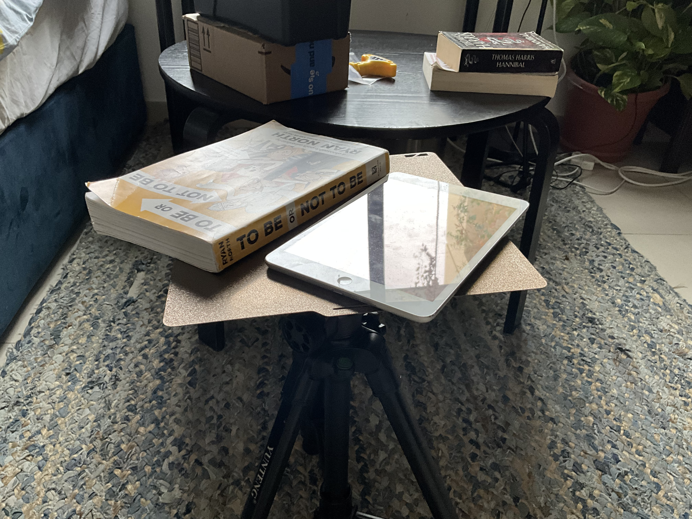

# FieldPlate

**FieldPlate** is a simple tripod attachment for reusing 3D printer build plates as portable tables.

More information and the models can be found on **Printables**:
[[https://www.printables.com/model/1815820]]

## What is FieldPlate?

FieldPlate started as a simple idea: take a 3D printer build plate and turn it into a portable table using a simple attachment system.

It is designed to be **simple to print, quick to build, and easy to take apart**. The build plate can be detached from the tripod when you need it for printing, then reattached when you want a portable table.

## What you need/ B.O.M
To get started, you will need:
* 1× compatible PEI build plate
* 12× 11 × 3 mm magnets
* Smaller magnets can also work
* 1× tripod
* M3 × 8 mm screws
* M3 × 10 mm screws can also work
* PLA filament

Other materials should also work, although the recommended settings are tested with PLA.

## Printing

Download the **correct release** for your build plate. Releases can be found on both Printables and GitHub.

Recommended slicer settings:

* **Infill:** 15%
* **Supports:** On
* **Material:** PLA
* **Other settings:** Default

## How does it work?

The FieldPlate attachment is a simple framework that connects a 3D printer build plate to a tripod.

Magnets hold the build plate in place, while four screw-mounted arms connect the framework to the tripod.

The result is a lightweight, removable table that lets you reuse a build plate outside of your 3D printer.

## Credits

**Designed by:** Ideaman27

**Models and project:** FieldPlate

**Printables:**
[[https://www.printables.com/model/1815820]]

If you remix or modify FieldPlate, please credit the original project and link back to this repository.
